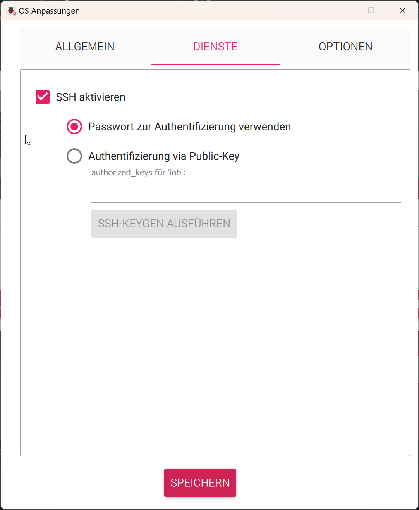

# kisshome-raspi-image
Creates Raspberry Pi Image with preinstalled kisshome-research adapter

## How to start
Create first with [Raspberry Pi Imager](https://www.raspberrypi.com/software/) the raspi image.


```bash
echo sudo apt update
sudo apt install -y git
cd /opt
sudo git clone https://github.com/GermanBluefox/kisshome-raspi-image
sudo chmod +x /opt/kisshome-raspi-image/install.sh
sudo /opt/kisshome-raspi-image/install.sh
```

## Copy image
Use [HDDRawCopy1.20Portable.exe](https://hddguru.com/software/HDD-Raw-Copy-Tool/HDDRawCopy1.20Portable.exe) or [win32diskimager-1.0.0-install.exe](https://sourceforge.net/projects/win32diskimager/files/latest/download) to make an image.




## After creation
The ssh login is `iob` and the password is `2024=smart!`. Change the password immediately after the first reboot!

The root password is `2024=smartroot!`.
